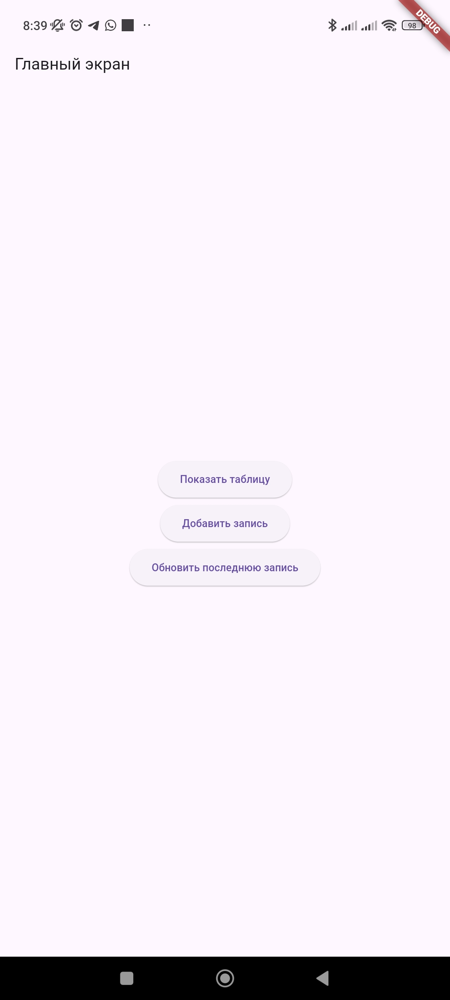
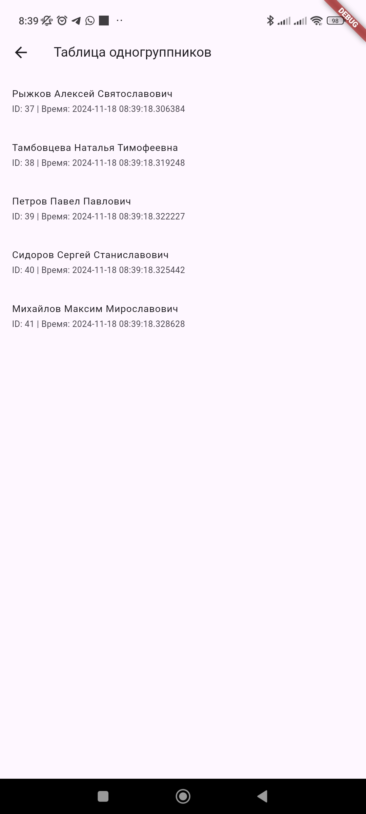
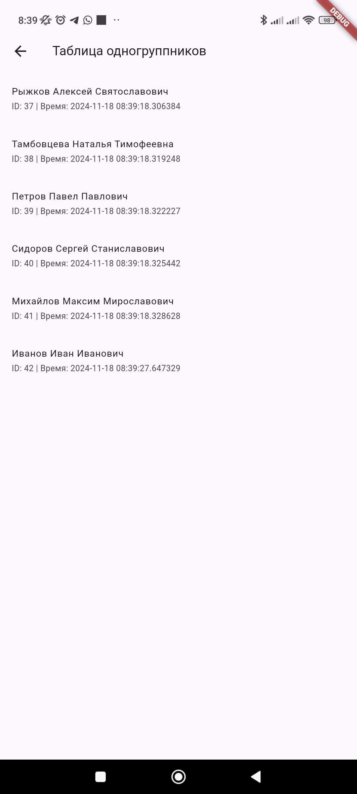

# Лабораторная работа №3. Работа с базой данных

Цель работы: Изучить работу Android приложения с базой данных.

*Выполнила*: Иволгина Елизавета  
*Язык*: Dart

*Задание 2*

## Описание
Приложение включает два экрана:

1. **Главный экран**:
    - Содержит три кнопки:
        - Показать таблицу (переход к экрану с записями)
        - Добавить новую запись
        - Обновить последнюю запись


2. **Экран таблицы**:
    - Показывает все записи из базы данных.



**При нажатии на кнопку "Новая запись"** в таблицу добавляется "Новый одногруппник И."

**При нажатии на кнопку "Обновить последнюю запись"** последняя запись таблицы меняется на "Иванов Иван Иванович"

База данных состоит из следующих полей:
- `id` (INTEGER) — уникальный идентификатор записи.
- `surname` (TEXT) — фамилия.
- `name` (TEXT) — имя.
- `patronymic` (TEXT) — отчество.
- `time_added` (TEXT) — время добавления записи.

## Как работает?
При запуске приложения база данных очищается, а затем заполняется пятью тестовыми записями. Это делается в функции `_clearDatabase()`:
```dart
Future<void> _clearDatabase() async {
  await DatabaseHelper().clearDatabase();
 ```
### Главный экран
На главном экране представлены три основные функции:
- Показать таблицу - открывающая другой экран.
 ```
 ElevatedButton(
  onPressed: () async {
    Navigator.push(
      context,
      MaterialPageRoute(builder: (context) => ViewRecordsScreen()),
    );
  },
  child: Text('Показать таблицу'),
)
 ```
- Добавить запись
```
ElevatedButton(
  onPressed: () async {
    await DatabaseHelper().addRecord('Новый одногруппник И.');
  },
  child: Text('Добавить запись'),
)
```
- Обновить последнюю запись
```
ElevatedButton(
  onPressed: () async {
    await DatabaseHelper().updateLastRecord();
  },
  child: Text('Обновить последнюю запись'),
)
```
### Экран таблицы
Экран таблицы отображает данные с помощью `FutureBuilder`:
```
class ViewRecordsScreen extends StatelessWidget {
  @override
  Widget build(BuildContext context) {
    return Scaffold(
      appBar: AppBar(title: Text('Таблица одногруппников')),
      body: FutureBuilder(
        future: DatabaseHelper().getAllRecords(),
        builder: (context, snapshot) {
          if (snapshot.connectionState == ConnectionState.waiting) {
            return Center(child: CircularProgressIndicator());
          } else if (snapshot.hasError) {
            return Center(child: Text('Ошибка: ${snapshot.error}'));
          } else {
            var records = snapshot.data as List<Map<String, dynamic>>;
            return ListView.builder(
              itemCount: records.length,
              itemBuilder: (context, index) {
                var record = records[index];
                return ListTile(
                  title: Text('${record['surname']} ${record['name']} ${record['patronymic']}'),
                  subtitle: Text('ID: ${record['id']} | Время: ${record['time_added']}'),
                );
              },
            );
          }
        },
      ),
    );
  }
}

```
### Работа с базой данных
При первом запуске создается таблица с полями `surname`, `name`, `patronymic` и `time_added`.
```
_onCreate(Database db, int version) async {
  await db.execute('''
    CREATE TABLE Одногруппники(
      id INTEGER PRIMARY KEY AUTOINCREMENT,
      surname TEXT,
      name TEXT,
      patronymic TEXT,
      time_added TEXT
    );
  ''');
}
```

База данных управляется с помощью класса `DatabaseHelper`. Основные методы:
- Добавление записи
Новая запись добавляется с разбиением строки на фамилию, имя и отчество
```
Future<void> addRecord(String fullName) async {
  var nameParts = fullName.split(' ');
  String surname = nameParts[0];
  String name = nameParts.length > 1 ? nameParts[1] : '';
  String patronymic = nameParts.length > 2 ? nameParts[2] : '';

  await db.insert('Одногруппники', {
    'surname': surname,
    'name': name,
    'patronymic': patronymic,
    'time_added': DateTime.now().toString(),
  });
}
```
- Обновление последней записи
```
Future<void> updateLastRecord() async {
  final db = await database;
  var lastRecord = await db.rawQuery('SELECT * FROM Одногруппники ORDER BY id DESC LIMIT 1');
  if (lastRecord.isNotEmpty) {
    await db.update(
      'Одногруппники',
      {'surname': 'Иванов', 'name': 'Иван', 'patronymic': 'Иванович'},
      where: 'id = ?',
      whereArgs: [lastRecord[0]['id']],
    );
  }
}
```
- Получение всех записей
```
Future<List<Map<String, dynamic>>> getAllRecords() async {
  final db = await database;
  return await db.query('Одногруппники');
}
```
### Как собрать
* Установите Flutter SDK.
* Настройте Android studio: Установите плагины Flutter и Dart.
1. Загрузите репозиторий
2. Запустите Android Studio
3. Нажмите на "Open" и выберите папку с проектом
4. Выберите эмулятор(или подключите реальное устройство)
5. Нажмите "Run"
